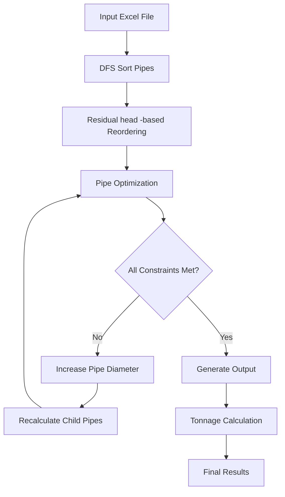

# Water Distribution System Pipe Optimization Tool

## Developed for application in large-scale water distribution system design workflows at Larsen & Toubro Water & Effluent Treatment IC

## Project Overview

This project is an automated pipe diameter optimization system designed for water distribution system planning. It helps engineers optimize pipe sizes in water distribution networks to meet hydraulic requirements while minimizing material costs.

## Problem Statement

In water distribution system planning, engineers need to:
- Ensure adequate water pressure at all nodes (especially village endpoints)
- Maintain velocity within acceptable limits (0.6-3.0 m/s)
- Minimize pipe material costs
- Handle complex network topologies with multiple branches

Manual optimization of pipe diameters is time-consuming and error-prone. This tool automates the process using hydraulic calculations and optimization algorithms.

## System Architecture

### Core Components

1. **Main Pipeline** (`main.py`)
   - Entry point that orchestrates the entire optimization process
   - Configures optimization parameters
   - Executes the optimization workflow

2. **Pipe Class** (`opti_classess.py`)
   - Defines the `Pipe` class with hydraulic calculations
   - Manages pipe properties: diameter, velocity, friction head loss, residual head
   - Handles velocity and pressure constraints

3. **Optimization Engine** (`optimizer.py`)
   - Core optimization algorithm
   - Implements iterative pipe sizing with constraint checking
   - Handles parent-child pipe relationships and cascading effects

4. **Network Sorting** (`dfs_sort.py`)
   - Sorts pipes in depth-first search order
   - Ensures parent pipes are processed before child pipes

5. **Residual head -Based Ordering** (`order_by_rhae.py`)
   - Reorders pipes based on residual head at endpoints
   - Optimizes processing sequence for better convergence

6. **Tonnage Calculation** (`tonnage.py`)
   - Calculates material tonnage for optimized pipes
   - Maps pipe specifications to material costs

7. **Reordering Logic** (`reorder.py`)
   - Handles complex reordering for pipes affecting multiple village endpoints
   - Implements second-pass optimization when needed

## Workflow



### Detailed Process Flow

1. **Input Processing**
   - Read pipe network data from Excel file (`e2.xlsx`)
   - Parse pipe properties: nodes, length, discharge, ground levels

2. **Network Sorting**
   - Apply DFS sorting to ensure proper processing order
   - Parent pipes are processed before their children

3. **Initial RHae Calculation**
   - Calculate initial residual head at endpoints
   - Reorder pipes by RHae values for optimal processing

4. **Optimization Loop**
   - For each pipe, check velocity and pressure constraints
   - If constraints fail, increase pipe diameter (IOP - Internal Diameter)
   - Recalculate hydraulic parameters for affected downstream pipes
   - Continue until all constraints are satisfied

5. **Constraint Validation**
   - **Velocity**: 0.6 ≤ velocity ≤ 3.0 m/s
   - **Pressure**: Minimum residual head at village endpoints (28m)
   - **Pressure**: Minimum residual head at intermediate nodes (0m)

6. **Material Calculation**
   - Map optimized pipe diameters to standard sizes
   - Calculate material tonnage and costs
   - Generate material summaries by type

## Key Features

### Hydraulic Calculations
- **Velocity Calculation**: `v = Q × 4 / (π × d²)`
- **Friction Head Loss**: Uses Hazen-Williams equation with C=1
- **Residual Head**: `RHe = (GL_start - GL_end) + RHs - FHL`

### Optimization Constraints
- **Minimum Velocity**: 0.6 m/s (prevents sedimentation)
- **Maximum Velocity**: 3.0 m/s (prevents erosion)
- **Minimum Village Pressure**: 28m residual head
- **Minimum Pipe Pressure**: 0m residual head

### Pipe Diameter Standards
The system uses standard pipe diameters (IOP values):
```
96.8, 111.6, 125, 142.8, 160.8, 178.6, 201, 223.4, 250.4, 314.8, 
366, 416.4, 466.8, 518, 619.6, 700, 800, 900, 1000, 1100, 1200, 
1300, 1400, 1500, 1600, 1700, 1800, 1900, 2000, 2100, 2200, 2300, 
2400, 2500 mm
```

## Input Data Format

### Pipe Network Data (e2.xlsx)
Required columns:
- `start_node`: Starting node identifier
- `end_node`: Ending node identifier  
- `length`: Pipe length in meters
- `discharge`: Flow rate in m³/s
- `ground_level_start`: Starting elevation in meters
- `ground_level_end`: Ending elevation in meters
- `manual_iop`: Manual override diameter (optional)

### Tonnage Data (tonnage.xlsx)
Required columns:
- `ID`: Pipe internal diameter
- `NB`: Nominal bore
- `thk`: Wall thickness
- `max_pressure`: Maximum pressure rating
- `density kg/m3`: Material density
- `rating`: Pressure rating (PN6, PN8, K7, K9, MS)

## Output Files

1. **manul_count.xlsx**: Optimized pipe network with calculated parameters
2. **tonned_pipes.xlsx**: Final results with material calculations
3. **neworder.xlsx**: Intermediate reordered network
4. **ft1.xlsx**: Pipes affecting multiple village endpoints

## Configuration Parameters

```python
MIN_VEL = 0.6          # Minimum velocity (m/s)
MAX_VEL = 3.0          # Maximum velocity (m/s)  
MIN_PIPE_RHAE = 0      # Minimum pressure at intermediate nodes (m)
MIN_VILLAGE_RHAE = 28  # Minimum pressure at village endpoints (m)
```

### Remaining Work
- [ ] **User Interface**: GUI or command-line interface
- [ ] **Advanced Features**: Multiple optimization algorithms, sensitivity analysis


## Usage Example

```python
# Run the optimization
python main.py

# Input: e2.xlsx (pipe network data)
# Input: tonnage.xlsx (material specifications)
# Output: tonned_pipes.xlsx (optimized results)
```

## Dependencies

- `pandas`: Data manipulation and Excel I/O
- `numpy`: Numerical calculations
- `openpyxl`: Excel file handling

## Future Enhancements

1. **Multi-objective Optimization**: Balance cost vs. reliability
2. **Pressure Zone Analysis**: Handle multiple pressure zones
3. **Water Quality Modeling**: Consider water age and quality
4. **GIS Integration**: Import/export from GIS systems
5. **Real-time Monitoring**: Integration with SCADA systems
6. **Machine Learning**: Predictive optimization models

## Contributing

This project is designed to assist water distribution system planners. Contributions are welcome for:
- Bug fixes and improvements
- Additional optimization algorithms
- Enhanced user interface
- Documentation and examples


---

*This tool represents a significant advancement in automating water distribution system design, reducing manual effort from days to minutes while ensuring optimal pipe sizing.*
